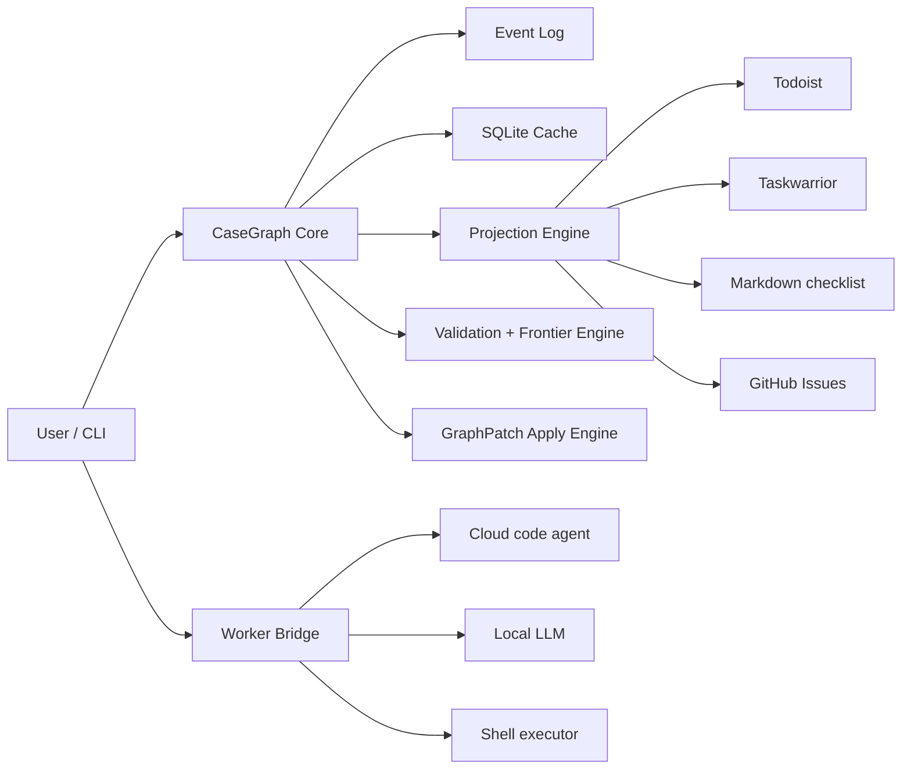

# CaseGraph Design Docs

English: [README.md](README.md)

**Version:** 0.1-draft  
**Project type:** public OSS, local-first, CLI-first

CaseGraph は、開発タスクにも一般タスクにも使える **ケースグラフ基盤** の設計案です。  
単なる Todo リストではなく、依存関係、待機イベント、代替経路、証跡を持つグラフとして仕事を扱います。

このドキュメント群は、**仕様を先に定義し、その上に参照実装を載せる** ための基本設計です。  
特定のタスク管理 SaaS や特定の LLM ベンダーを前提にしません。外部 SaaS sync / sink は optional integration ですが、markdown sync は v0.1 の reference integration として含めます。

Phase 0 の freeze では、`0.1-draft` のうち **Phase 1 core CLI surface** を先に固定します。  
patch / import / sync / worker などの能力は設計に含めつつ、CLI 名と UX は後続フェーズで決めます。  
Phase 2 の参照実装では、未凍結の working surface として `cg patch ...` と `cg import markdown` を使います。

---

## 1. この Project が解く問題

CaseGraph が対象にするのは、次のような仕事です。

- 依存関係があり、単純な順番では進まない
- 一部は並列化できるが、一部は待機や承認が必要
- 状況変化があったら、局所的に再計画したい
- 証拠や履歴を残しながら進めたい
- 開発タスクと一般タスクを同じ核で扱いたい
- Claude Code / Codex / local LLM などを使うとしても、中心ロジックをそれらに依存させたくない

---

## 2. 設計原則

1. **Local-first**  
   データの正本はローカルに置く。

2. **Deterministic core**  
   状態遷移、frontier 計算、検証、同期差分は決定論的に扱う。

3. **AI is patch-producing, not state-owning**  
   AI は graph を直接変更せず、`GraphPatch` を提案する。

4. **External tools are projections**  
   Todoist, Taskwarrior, GitHub Issues などは内部 graph の投影先とみなす。

5. **Narrow waist**  
   公開 project として、安定した中核仕様を小さく保つ。

6. **CLI first, not CLI only**  
   最初の操作面は CLI にしつつ、内部には event log / cache / adapter protocol を持つ。

---

## 3. ドキュメント構成

### 仕様
- [Spec index](docs/spec/index.md)
- [Overview](docs/spec/00-overview.md)
- [Domain model](docs/spec/01-domain-model.md)
- [Storage model](docs/spec/02-storage.md)
- [State and frontier](docs/spec/03-state-and-frontier.md)
- [GraphPatch](docs/spec/04-graphpatch.md)
- [CLI specification](docs/spec/05-cli.md)
- [Adapter protocol](docs/spec/06-adapter-protocol.md)
- [Worker protocol](docs/spec/07-worker-protocol.md)
- [Projections and sync](docs/spec/08-projections.md)
- [Security and trust](docs/spec/09-security-and-trust.md)
- [Testing strategy](docs/spec/10-testing-strategy.md)
- [Schema reference](docs/spec/11-schema-reference.md)

### ADR
- [ADR-0001: Local-first and deterministic core](docs/adr/0001-local-first.md)
- [ADR-0002: Event log + SQLite cache](docs/adr/0002-event-log-cache.md)
- [ADR-0003: Patch-mediated AI integration](docs/adr/0003-patch-mediated-ai.md)
- [ADR-0004: External tools are projections](docs/adr/0004-external-tools-are-projections.md)
- [ADR-0005: JSON-RPC over stdio plugin protocol](docs/adr/0005-jsonrpc-stdio-plugin-protocol.md)
- [ADR-0006: Topology projections and Betti-v1 design](docs/adr/0006-topology-projections-and-betti-v1.md)

### 例
- [Release case](docs/examples/release-case.md)
- [Move case](docs/examples/move-case.md)

### Guides
- [Quickstart (EN)](docs/guides/quickstart.en.md)
- [Quickstart (JA)](docs/guides/quickstart.ja.md)
- [v0.1 Release Checklist (EN)](docs/guides/release-checklist.en.md)
- [v0.1 Release Checklist (JA)](docs/guides/release-checklist.ja.md)
- [npm Release Guide (EN)](docs/guides/npm-release.en.md)
- [npm Release Guide (JA)](docs/guides/npm-release.ja.md)
- [Manual Acceptance (EN)](docs/guides/manual-acceptance.en.md)
- [Manual Acceptance (JA)](docs/guides/manual-acceptance.ja.md)

### Releases
- [v0.1.0-rc1 Candidate Note (EN)](docs/releases/v0.1.0-rc1.en.md)
- [v0.1.0-rc1 Candidate Note (JA)](docs/releases/v0.1.0-rc1.ja.md)

### 補足
- [Project governance](docs/project-governance.md)
- [Roadmap](docs/roadmap.md)

---

## 4. システム像



---

## 5. v0.1 のスコープ

### 含める
- case 作成
- node / edge 管理
- event log
- frontier / blocker 計算
- graph structure / path analysis (`impact`, `critical-path`, `slack`, `bottlenecks`, `unblock`, `cycles`, `components`, `bridges`, `cutpoints`, `fragility`)
- GraphPatch
- CLI
- importer / worker の基本プロトコル
- markdown projection / sync
- optional な external projection / sync protocol
- local-first ストレージ
- 最低限の reverse sync

### 含めない
- Web UI 中心の運用
- 本格的な multi-user server
- 完全自律エージェント
- 高度なスケジューリング最適化
- すべての外部サービスへの深い連携

### Phase 0 freeze note
- 凍結する CLI は case / graph / state / frontier / blockers / storage recovery に限定する
- GraphPatch, importer, projection, worker は v0.1 の設計対象だが、CLI surface は未凍結
- `cg case view` は参照実装の read-only working surface として残すが、広い TUI / graph view は未凍結
- markdown sync は reference integration として含める
- external sink support は optional integration track とし、core roadmap completion の必須条件には含めない

---

## 5.5 Graph View Guardrail

Phase 5 で必要だったのは、広い TUI を先に spec 化することではなく、  
**グラフを安全に読む surface をどこまで許すか** を固定することでした。

- source of truth は event log + deterministic replay のまま
- graph view は read-only inspection を優先する
- `cg case view` は `!` actionable / `✓` done / `→` waiting / `✗` blocked を使い、shared node は `= ... (shared)` で重複 subtree を避ける
- stable な TUI protocol / schema / layout contract はまだ置かない
- 現行の public working surface は `cg case view` に留める

---

## 6. Topology Today

CaseGraph が今持っている topology は、**依存グラフに対する内部計算の仕組み** です。  
ユーザーに見せる面は、raw topology そのものではなく、仕事の構造を説明する analysis surface です。

- `impact`: 変更や失敗の波及先
- `critical-path`: 未解決 hard dependency の最長鎖
- `slack`: 余裕時間と critical node
- `bottlenecks`: downstream 影響の大きい node
- `unblock`: blocked node を ready にする最小 leaf 集合
- `cycles`: hard graph に循環があるか
- `components`: 未解決 hard graph の分断
- `bridges`: 一本切れると分断する依存
- `cutpoints`: 一点欠けると分断する node
- `fragility`: 橋・切断点・downstream 影響をまとめた脆さ順位

これらは `depends_on` / `waits_for` / `contributes_to` を使う決定論的解析で、  
現在の参照実装と golden corpus で継続検証されています。

共有する substrate は次に限定して固定します。

- `hard_unresolved` は `todo` / `doing` / `waiting` / `failed` の unresolved node と、それらの間にある hard edge (`depends_on`, `waits_for`) だけを使う
- `hard_goal_scope(goal_node_id)` は `contributes_to` で goal に届く unresolved contributor から始め、そこから unresolved hard prerequisite closure を取る。goal node 自体や resolved node は projected graph に入れない
- scoping 後の graph は simple undirected に正規化し、direction は落とし、同じ endpoint pair の multi-edge は 1 本に潰し、self-loop は warning `self_loop_ignored` を返して無視する
- goal-scoped projection に unresolved node が 1 件もない場合は failure ではなく、empty result + warning `scope_has_no_unresolved_nodes` を返す

### Structural risk explanation contract

structural risk explanation contract は、user-facing analysis level で次のように固定します。

- `beta_0` / `components` は、未解決作業の disconnected region を説明する
- `beta_1` / cycle witness は、dependency loop または mutual blocking structure を説明する
- `bridges` は、削除すると未解決作業 region を分断する single dependency edge を説明する
- `cutpoints` は、削除すると未解決作業 region を分断する single task / event を説明する
- `fragility` は、evidence tag / metric つきで優先して介入すべき candidate を説明する

JSON result は machine-readable evidence を保持します。projection metadata (`case_id`, `revision`, `projection`, `goal_node_id`, `warnings`) と、
surface ごとの node id、edge pair、分離された node set、raw count、有用な metric (component size や fragility scoring signal など) を返します。
projection / normalization warning は derived surface へ伝播します。
これらの output は read-only projection であり、event 追記、projection mapping 更新、graph state mutation、新しい source of truth の作成は行いません。

最小の JSON shape は次の通りです。

```json
{
  "case_id": "release-structure",
  "revision": {
    "current": 12,
    "last_event_id": "01HZ..."
  },
  "projection": "hard_goal_scope",
  "goal_node_id": "goal_release_ready",
  "warnings": [],
  "nodes": ["task_prepare", "task_review"],
  "edges": [
    {
      "source_id": "task_review",
      "target_id": "task_prepare"
    }
  ],
  "components": [
    {
      "node_ids": ["task_prepare", "task_review"],
      "node_count": 2,
      "edge_count": 1
    }
  ],
  "cycle_witnesses": [],
  "bridges": [
    {
      "source_id": "task_review",
      "target_id": "task_prepare"
    }
  ],
  "cutpoints": [],
  "fragility": [
    {
      "node_id": "task_prepare",
      "reason_tags": ["bridge"]
    }
  ]
}
```

`topology` 自体は core / eval 用の experimental mechanism として残し、  
root の `@caphtech/casegraph-core` ではなく `@caphtech/casegraph-core/experimental` からだけ参照できるようにし、  
安定した user-facing command surface には直接出しません。

---

## 7. Deferred Algebraic Topology

一方で、CaseGraph には将来的に **projection 後の代数トポロジー計算** を入れる余地があります。

現時点では experimental core surface として、次を v1 の対象に固定しています。

- undirected projection 上の `Betti-0`
- undirected projection 上の `Betti-1`
- component / cycle witness の説明 surface
- raw topology の projection 名は `hard_unresolved` と `hard_goal_scope(goal_node_id)` だけに固定する

非対象:

- persistent homology
- temporal topology の first-class API
- high-dimensional simplex / Betti-2+
- `hard_unresolved` / `hard_goal_scope(goal_node_id)` 以外の新しい projection semantics
- stable CLI / public schema の追加
- graph-reading / analysis surface の broad UX redesign
- analysis output からの mutation / source-of-truth 変更

参照実装では `packages/core` の raw topology API を `@caphtech/casegraph-core/experimental` に隔離し、  
stable CLI は `cycles` / `components` / `bridges` / `cutpoints` / `fragility` に留め、  
`analysis-eval` harness で `beta_0` / `beta_1` / component set と scoped edge case の warning を継続検証しています。

詳細は [ADR-0006](docs/adr/0006-topology-projections-and-betti-v1.md) を参照。

---

## 8. 推奨リポジトリ構成

```text
/docs
  /adr
  /spec
  /examples
/packages
  /core
  /cli
  /adapters
  /workers
/tests
```

---

## 9. 一文要約

**CaseGraph は、ケースを依存・待機・代替・証跡つきのグラフとして管理し、決定論的コアの上に AI 補助と外部ツール連携を載せる local-first CLI 基盤である。**

## 10. License

This repository is licensed under the Apache License 2.0. See [LICENSE](../LICENSE).
