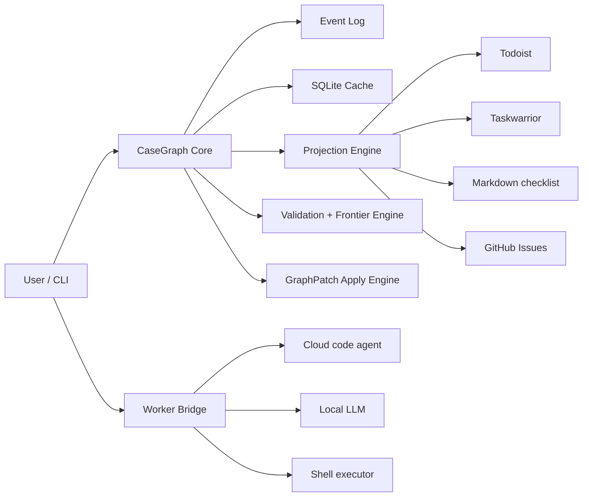

# CaseGraph Design Docs

Japanese: [README.ja.md](README.ja.md)

**Version:** 0.1-draft  
**Project type:** public OSS, local-first, CLI-first

CaseGraph is a proposed **case graph substrate** that can support both software work and general task management.  
Instead of treating work as a flat todo list, it models work as a graph with dependencies, waiting events, alternative paths, and evidence.

This document set defines the baseline design for a **spec-first approach with a reference implementation on top**.  
It does not assume any specific task-management SaaS or LLM vendor. External SaaS sync and sink integrations are optional, while markdown sync is included as the v0.1 reference integration.

The Phase 0 freeze locks down the **Phase 1 core CLI surface** within `0.1-draft` first.  
Patch, import, sync, worker, and related capabilities remain part of the design, but their CLI names and UX are decided in later phases.  
In the Phase 2 reference implementation, `cg patch ...` and `cg import markdown` remain available as unfrozen working surfaces.

---

## 1. Problems This Project Solves

CaseGraph is designed for work with characteristics like these:

- dependencies exist and a simple linear ordering is not enough
- some parts can run in parallel, while others require waiting or approval
- when the situation changes, replanning should be local rather than global
- evidence and history should remain attached to the work
- software tasks and general tasks should share the same core model
- even when using Claude Code, Codex, local LLMs, or similar tools, the core logic should not depend on them

---

## 2. Design Principles

1. **Local-first**  
   The source of truth lives locally.

2. **Deterministic core**  
   State transitions, frontier calculation, validation, and sync diffs are deterministic.

3. **AI is patch-producing, not state-owning**  
   AI does not mutate the graph directly. It proposes a `GraphPatch`.

4. **External tools are projections**  
   Todoist, Taskwarrior, GitHub Issues, and similar systems are treated as projections of the internal graph.

5. **Narrow waist**  
   As a public project, the stable core specification should remain small and disciplined.

6. **CLI first, not CLI only**  
   The first operating surface is a CLI, but the internals include an event log, cache, and adapter protocol.

---

## 3. Document Structure

### Specs
- [Spec index](docs/spec/index.md)
- [Overview](docs/spec/00-overview.md)
- [Domain model](docs/spec/01-domain-model.md)
- [Storage model](docs/spec/02-storage.md)
- [State and frontier](docs/spec/03-state-and-frontier.md)
- [GraphPatch](docs/spec/04-graphpatch.md)
- [CLI specification](docs/spec/05-cli.md)
- [Adapter protocol](docs/spec/06-adapter-protocol.md)
- [Worker protocol](docs/spec/07-worker-protocol.md)
- [Projections and sync](docs/spec/08-projections.md)
- [Security and trust](docs/spec/09-security-and-trust.md)
- [Testing strategy](docs/spec/10-testing-strategy.md)
- [Schema reference](docs/spec/11-schema-reference.md)

### ADRs
- [ADR-0001: Local-first and deterministic core](docs/adr/0001-local-first.md)
- [ADR-0002: Event log + SQLite cache](docs/adr/0002-event-log-cache.md)
- [ADR-0003: Patch-mediated AI integration](docs/adr/0003-patch-mediated-ai.md)
- [ADR-0004: External tools are projections](docs/adr/0004-external-tools-are-projections.md)
- [ADR-0005: JSON-RPC over stdio plugin protocol](docs/adr/0005-jsonrpc-stdio-plugin-protocol.md)
- [ADR-0006: Topology projections and Betti-v1 design](docs/adr/0006-topology-projections-and-betti-v1.md)

### Examples
- [Release case](docs/examples/release-case.md)
- [Move case](docs/examples/move-case.md)

### Guides
- [Quickstart (EN)](docs/guides/quickstart.en.md)
- [Quickstart (JA)](docs/guides/quickstart.ja.md)
- [v0.1 Release Checklist (EN)](docs/guides/release-checklist.en.md)
- [v0.1 Release Checklist (JA)](docs/guides/release-checklist.ja.md)
- [npm Release Guide (EN)](docs/guides/npm-release.en.md)
- [npm Release Guide (JA)](docs/guides/npm-release.ja.md)
- [Manual Acceptance (EN)](docs/guides/manual-acceptance.en.md)
- [Manual Acceptance (JA)](docs/guides/manual-acceptance.ja.md)

### Releases
- [v0.1.0-rc1 Candidate Note (EN)](docs/releases/v0.1.0-rc1.en.md)
- [v0.1.0-rc1 Candidate Note (JA)](docs/releases/v0.1.0-rc1.ja.md)

### Supplemental
- [Project governance](docs/project-governance.md)
- [Roadmap](docs/roadmap.md)

---

## 4. System View



---

## 5. Scope of v0.1

### Included
- case creation
- node and edge management
- event log
- frontier and blocker calculation
- graph structure and path analysis (`impact`, `critical-path`, `slack`, `bottlenecks`, `unblock`, `cycles`, `components`, `bridges`, `cutpoints`, `fragility`)
- GraphPatch
- CLI
- base importer and worker protocol
- markdown projection and sync
- optional external projection and sync protocol
- local-first storage
- minimum viable reverse sync

### Excluded
- web-UI-centered operation
- a full multi-user server
- fully autonomous agents
- advanced scheduling optimization
- deep integration with every external service

### Phase 0 freeze note
- The frozen CLI is limited to case, graph, state, frontier, blockers, and storage recovery.
- GraphPatch, importer, projection, and worker are in scope for v0.1 design, but their CLI surface remains unfrozen.
- `cg case view` remains as a read-only working surface in the reference implementation, but broader TUI or graph-view surfaces remain unfrozen.
- Markdown sync is included as the reference integration.
- External sink support remains an optional integration track and is not required for core roadmap completion.

---

## 5.5 Graph View Guardrail

What Phase 5 needed was not an early full TUI specification.  
It needed a fixed boundary for **how far a graph-reading surface is allowed to go safely**.

- the source of truth remains the event log plus deterministic replay
- graph view prioritizes read-only inspection
- `cg case view` uses `!` actionable, `✓` done, `→` waiting, and `✗` blocked, while shared nodes use `= ... (shared)` to avoid repeated subtrees
- no stable TUI protocol, schema, or layout contract is defined yet
- the current public working surface is limited to `cg case view`

---

## 6. Topology Today

The topology that CaseGraph has today is an **internal computation mechanism over dependency graphs**.  
The user-facing surface is not raw topology itself, but analysis surfaces that explain work structure.

- `impact`: what changes or failures propagate to
- `critical-path`: the longest unresolved hard-dependency chain
- `slack`: schedule slack and critical nodes
- `bottlenecks`: nodes with large downstream impact
- `unblock`: the minimal set of leaves required to make a blocked node ready
- `cycles`: whether the hard graph contains cycles
- `components`: disconnected regions in the unresolved hard graph
- `bridges`: dependencies whose removal disconnects the graph
- `cutpoints`: nodes whose removal disconnects the graph
- `fragility`: a combined ranking over bridges, cutpoints, and downstream impact

These are deterministic analyses over `depends_on`, `waits_for`, and `contributes_to`,  
and they are continuously checked against the current reference implementation and golden corpus.

The shared substrate is fixed narrowly:

- `hard_unresolved` means unresolved nodes in `todo` / `doing` / `waiting` / `failed` plus only hard edges (`depends_on`, `waits_for`) between them
- `hard_goal_scope(goal_node_id)` starts from unresolved contributors that reach the goal through `contributes_to`, then closes over unresolved hard prerequisites; the goal node itself and resolved nodes are not injected into the projected graph
- after scoping, the graph is normalized to a simple undirected form: direction is erased, duplicate endpoint pairs collapse to one edge, and self-loops are ignored with warning `self_loop_ignored`
- if a goal-scoped projection has no unresolved nodes, the result stays empty and returns warning `scope_has_no_unresolved_nodes` instead of failing

The structural risk explanation contract is frozen at the user-facing analysis level:

- `beta_0` / `components` explain disconnected unresolved work regions
- `beta_1` / cycle witnesses explain dependency loops or mutual blocking structures
- `bridges` explain single dependency edges whose removal separates unresolved work regions
- `cutpoints` explain single tasks or events whose removal separates unresolved work regions
- `fragility` explains prioritized intervention candidates with evidence tags and metrics

JSON results preserve machine-readable evidence: projection metadata (`case_id`, `revision`, `projection`, `goal_node_id`, `warnings`) plus surface-specific node ids, edge pairs, separated node sets, raw counts, and useful metrics such as component sizes and fragility scoring signals. Projection and normalization warnings propagate to every derived surface, and the outputs remain read-only projections: they do not append events, update projection mappings, mutate graph state, or create a new source of truth.

`topology` itself remains an experimental mechanism for core and evaluation use.  
It is only exposed through `@caphtech/casegraph-core/experimental`, not the root `@caphtech/casegraph-core`,  
and it is not surfaced directly as a stable user-facing command.

---

## 7. Deferred Algebraic Topology

CaseGraph also leaves room for **algebraic-topology computation over projections** in the future.

At the moment, the experimental core surface fixes the following as the v1 target:

- `Betti-0` over an undirected projection
- `Betti-1` over an undirected projection
- explanation surfaces for component and cycle witnesses
- `hard_unresolved` and `hard_goal_scope(goal_node_id)` as the only supported projection names for raw topology

Out of scope:

- persistent homology
- first-class temporal topology APIs
- high-dimensional simplices and Betti-2+
- new projection semantics beyond `hard_unresolved` and `hard_goal_scope(goal_node_id)`
- new stable CLI or public schema additions
- broad UX redesign of graph-reading or analysis surfaces
- mutation or source-of-truth changes from analysis output

In the reference implementation, the raw topology API in `packages/core` is isolated under `@caphtech/casegraph-core/experimental`,  
the stable CLI stays on `cycles`, `components`, `bridges`, `cutpoints`, and `fragility`,  
and the `analysis-eval` harness continuously checks `beta_0`, `beta_1`, component sets, and warning behavior on scoped edge cases.

See [ADR-0006](docs/adr/0006-topology-projections-and-betti-v1.md) for details.

---

## 8. Recommended Repository Structure

```text
/docs
  /adr
  /spec
  /examples
/packages
  /core
  /cli
  /adapters
  /workers
/tests
```

---

## 9. One-Sentence Summary

**CaseGraph is a local-first CLI substrate that manages cases as graphs with dependencies, waits, alternatives, and evidence, then layers AI assistance and external tool integration on top of a deterministic core.**

## 10. License

This repository is licensed under the Apache License 2.0. See [LICENSE](../LICENSE).
