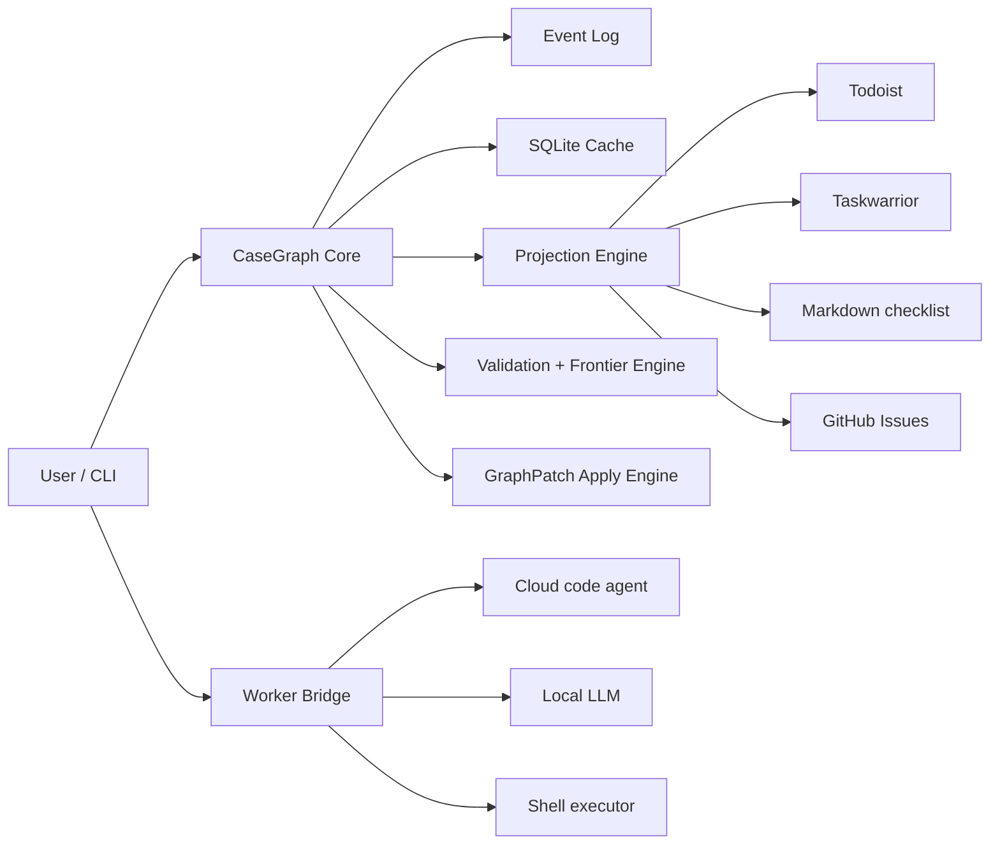

# CaseGraph Design Docs

**Version:** 0.1-draft  
**Project type:** public OSS, local-first, CLI-first

CaseGraph は、開発タスクにも一般タスクにも使える **ケースグラフ基盤** の設計案です。  
単なる Todo リストではなく、依存関係、待機イベント、代替経路、証跡を持つグラフとして仕事を扱います。

このドキュメント群は、**仕様を先に定義し、その上に参照実装を載せる** ための基本設計です。  
特定のタスク管理 SaaS や特定の LLM ベンダーを前提にしません。Todoist は一例の projection sink に過ぎません。

---

## 1. この project が解く問題

CaseGraph が対象にするのは、次のような仕事です。

- 依存関係があり、単純な順番では進まない
- 一部は並列化できるが、一部は待機や承認が必要
- 状況変化があったら、局所的に再計画したい
- 証拠や履歴を残しながら進めたい
- 開発タスクと一般タスクを同じ核で扱いたい
- Claude Code / Codex / local LLM などを使うとしても、中心ロジックをそれらに依存させたくない

---

## 2. 設計原則

1. **Local-first**  
   データの正本はローカルに置く。

2. **Deterministic core**  
   状態遷移、frontier 計算、検証、同期差分は決定論的に扱う。

3. **AI is patch-producing, not state-owning**  
   AI は graph を直接変更せず、`GraphPatch` を提案する。

4. **External tools are projections**  
   Todoist, Taskwarrior, GitHub Issues などは内部 graph の投影先とみなす。

5. **Narrow waist**  
   公開 project として、安定した中核仕様を小さく保つ。

6. **CLI first, not CLI only**  
   最初の操作面は CLI にしつつ、内部には event log / cache / adapter protocol を持つ。

---

## 3. ドキュメント構成

### 仕様
- [Spec index](docs/spec/index.md)
- [Overview](docs/spec/00-overview.md)
- [Domain model](docs/spec/01-domain-model.md)
- [Storage model](docs/spec/02-storage.md)
- [State and frontier](docs/spec/03-state-and-frontier.md)
- [GraphPatch](docs/spec/04-graphpatch.md)
- [CLI specification](docs/spec/05-cli.md)
- [Adapter protocol](docs/spec/06-adapter-protocol.md)
- [Worker protocol](docs/spec/07-worker-protocol.md)
- [Projections and sync](docs/spec/08-projections.md)
- [Security and trust](docs/spec/09-security-and-trust.md)
- [Testing strategy](docs/spec/10-testing-strategy.md)
- [Schema reference](docs/spec/11-schema-reference.md)

### ADR
- [ADR-0001: Local-first and deterministic core](docs/adr/0001-local-first.md)
- [ADR-0002: Event log + SQLite cache](docs/adr/0002-event-log-cache.md)
- [ADR-0003: Patch-mediated AI integration](docs/adr/0003-patch-mediated-ai.md)
- [ADR-0004: External tools are projections](docs/adr/0004-external-tools-are-projections.md)
- [ADR-0005: JSON-RPC over stdio plugin protocol](docs/adr/0005-jsonrpc-stdio-plugin-protocol.md)

### 例
- [Release case](docs/examples/release-case.md)
- [Move case](docs/examples/move-case.md)

### 補足
- [Project governance](docs/project-governance.md)
- [Roadmap](docs/roadmap.md)

---

## 4. システム像



---

## 5. v0.1 のスコープ

### 含める
- case 作成
- node / edge 管理
- event log
- frontier / blocker 計算
- GraphPatch
- CLI
- importer / sink / worker の基本プロトコル
- local-first ストレージ
- 最低限の reverse sync

### 含めない
- Web UI 中心の運用
- 本格的な multi-user server
- 完全自律エージェント
- 高度なスケジューリング最適化
- すべての外部サービスへの深い連携

---

## 6. 推奨リポジトリ構成

```text
/docs
  /adr
  /spec
  /examples
/packages
  /core
  /cli
  /adapters
  /workers
/tests
```

---

## 7. 一文要約

**CaseGraph は、ケースを依存・待機・代替・証跡つきのグラフとして管理し、決定論的コアの上に AI 補助と外部ツール連携を載せる local-first CLI 基盤である。**
