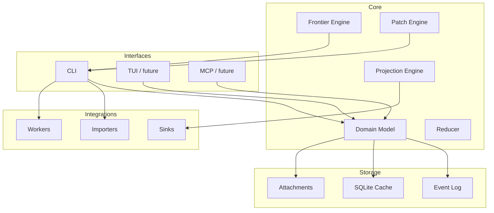

# 00. Overview

## 0.1 背景

複雑な仕事は、単なるタスクリストに還元すると重要な情報が消えます。  
典型的には次が消えます。

- 何が何に依存しているか
- 何が単なる推奨順で、何が hard dependency か
- どの作業が外部イベント待ちか
- どの選択肢が代替経路か
- 何をもって完了とみなすか
- 状況変化が起きたとき、どこまで再計画が必要か

開発タスクでは、コード・API・レビュー・テスト・リリースが絡みます。  
一般タスクでは、書類・返答待ち・予約・移動・時間窓・証跡が絡みます。  
両者は表面上違いますが、**ケースの中に複数種の制約と状態がある** という点で共通です。

CaseGraph は、この共通構造を扱うための基盤です。

---

## 0.2 問題定義

CaseGraph は以下の問いに答えられる必要があります。

1. **今やれることは何か**
2. **今やれない理由は何か**
3. **ある変更が入ったとき、どこを再計画すべきか**
4. **何をもって完了と言えるか**
5. **外部ツールへ何を投影すべきか**

---

## 0.3 設計目標

### 必須目標
- local-first
- deterministic core
- CLI-first
- extensible
- vendor-neutral
- audit-friendly

### 望ましい目標
- Git に乗せやすい
- public OSS として adapter / worker ecosystem を作りやすい
- AI 連携があっても、AI 非依存で使える
- 開発タスクと一般タスクの両方を扱える

### 明示的な非目標
- 初期段階からの複雑な multi-user server
- scheduler / optimizer の総合問題
- 自動的にすべてを分解・実行する完全自律 agent

---

## 0.4 システム境界

---

## 0.5 主要概念

- **Workspace**: 複数 case を束ねるローカル単位
- **Case**: 一件の案件・テーマ・ライフイベント
- **Node**: goal / task / decision / event / evidence
- **Edge**: depends_on / waits_for / alternative_to / verifies / contributes_to
- **Event Log**: append-only の変更履歴
- **Reducer**: event log から現在状態を構築
- **Frontier**: 今すぐ着手できる actionables
- **GraphPatch**: AI または外部処理が返す差分提案
- **Projection**: 内部 graph を外部ツール表現へ投影したもの
- **Worker**: task を外部で実行するコンポーネント

---

## 0.6 中核の設計判断

### 1. 「タスク管理」ではなく「ケース管理」
CaseGraph はカード型タスク一覧の代替ではなく、ケースの構造と進行を扱う。

### 2. 「AI が中核」ではなく「AI は補助」
AI は分解案や patch を生成してよいが、正本を持たない。

### 3. 「外部サービス中心」ではなく「内製の source of truth」
Todoist や GitHub Issues は投影先。内部モデルの従属先にしない。

### 4. 「木」ではなく「グラフ」
依存、待機、代替、証跡、寄与は一本の木では表現しきれない。

---

## 0.7 想定ユースケース

### 開発系
- 大規模機能追加
- 障害対応
- SDK / library 更新
- リファクタリング
- リリース運営

### 一般タスク系
- 引っ越し
- 旅行計画
- 行政手続き
- 採用活動
- イベント開催

### 混成系
- 技術顧問案件運営
- 顧客導入支援
- プロダクト運営

---

## 0.8 v0.1 の制約

v0.1 では、複雑さを抑えるために次を切り捨てます。

- actor / resource / location / compensation を第一級にしない
- goal 自動完了推論を過度にやらない
- 過剰な edge 種別を入れない
- 双方向同期を一般問題として解き切らない
- multi-user conflict resolution を本格化しない

代わりに、**最小限の核が正しく働くこと** を優先します。

---

## 0.9 成功条件

v0.1 の成功条件は、次の 4 点です。

1. 複雑な case を最小のノード/辺で表現できる
2. `frontier` と `blockers` が実務的に使える
3. patch を介して AI を安全に補助利用できる
4. actionables / summary を markdown に投影できる
